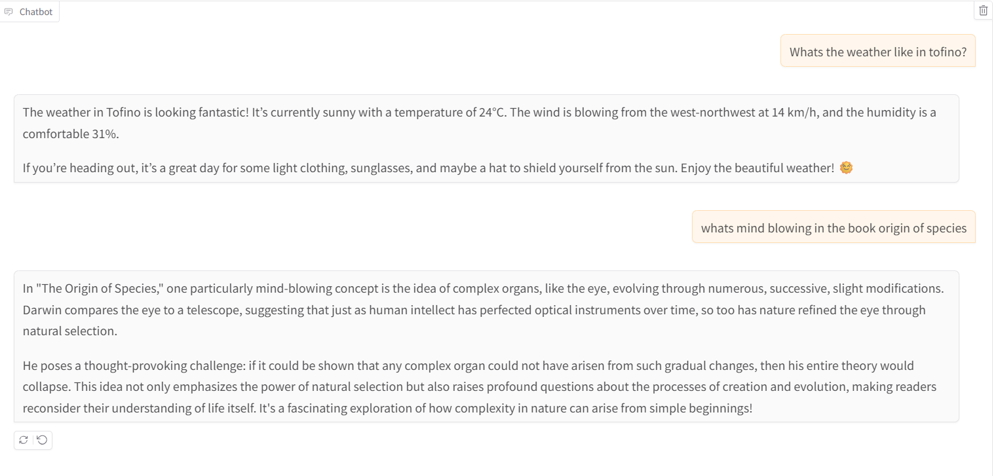

# Assignment 2: A Simple Chat about Weather , News and Book

The goal is to have simple interface for chat about current weather, headline news and book discussion on "Origin of Species"

## Services

This implementation is based on LangGraph's tools. 

The file main.py contains the llm model calls that controls the chat. Tools are in the files *service.py.

### Service 1: API Calls

+ The API calls https://api.weatherstack.com/current and uses api key to get current weather in a city. 
+ Each tool is imported to main and included in the list `tools`.
+ The tools node uses LangGraph's `ToolNode` class and `tools_condition` is the standard tool stopping criteria.
+ All restrictions and tone requirements are in the instructions prompt in prompts.py.

### Service 2: Semantic Query

+ This simple implementation is based on "Origin of Species" downloaded from https://www.gutenberg.org/.
+ The tool is also imported from its *service.py file.
+ The embeddings are created via 05_src\assignment_chat\cromadb_embed.ipynb and stored in local dir chroma_db
+ The service is used to search the stored embeddings : chromadb_askservice.py

### Service 3: Your Choice : News
+ The API calls https://gnews.io/api/v4/top-headlines and uses api key to get top headlines in canada. 
+ 

### UI
+ UI is implemented using gradio and it calls app.py

### Sample Run

